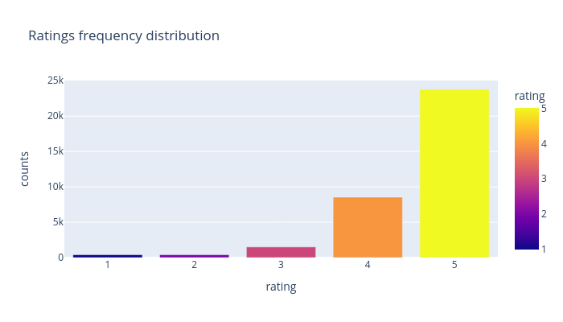
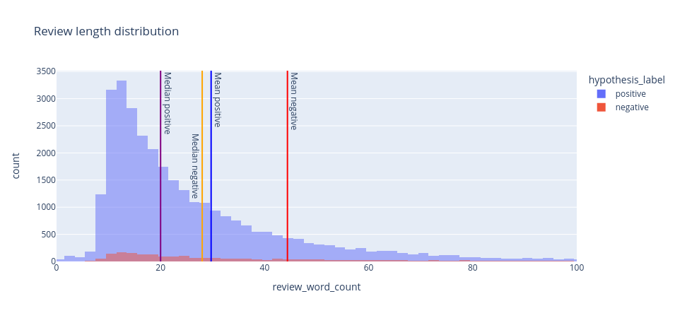
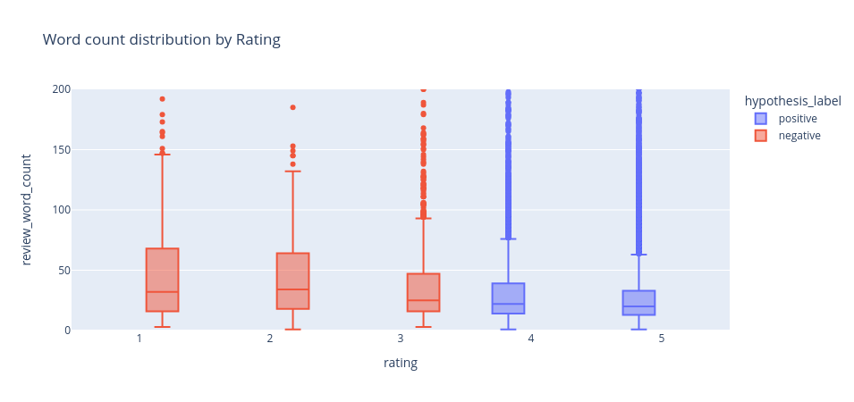
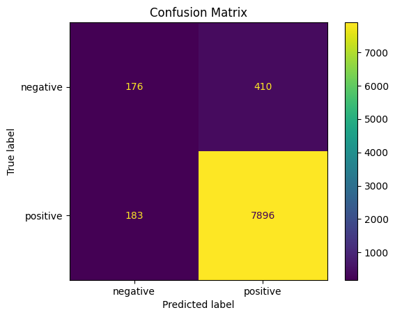
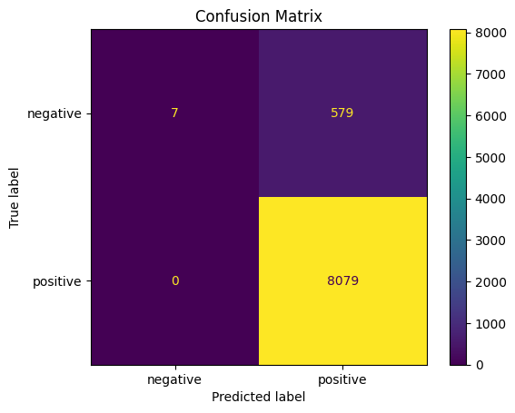
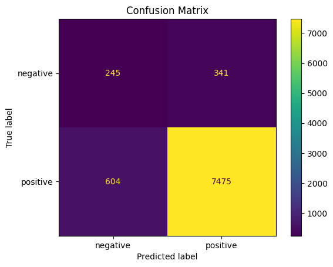
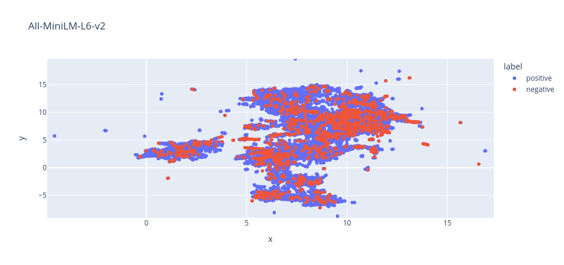
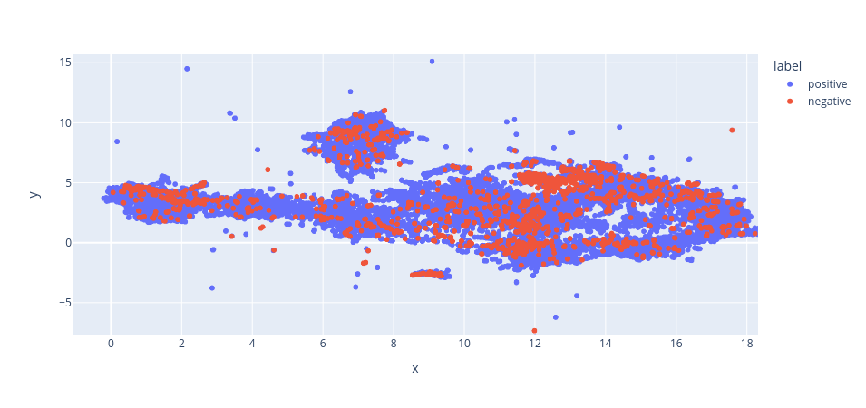
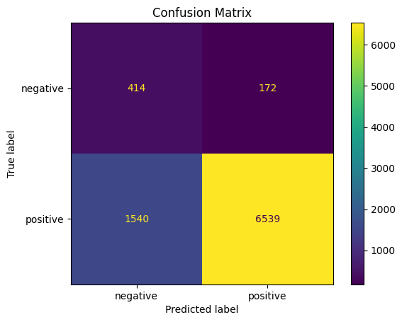

## Product reviews sentiment analysis [WIP]

This is a sentiment analysis project created using a product reviews dataset given [here](https://gfc.target.com/cmsti/f46a7ece-a8d2-4c71-a5ef-1cc9c3df8e3e.xlsx). It includes product information and ratings and reviews given by users. I have assumed review score less than 3 to be negative and greater than 3 to be positive on a scale of 5. This makes it an imbalanced dataset.

### Data analysis

I did a thorough data analysis to understand the underlying patterns so as to take decisions while modelling. Below are some plots which make it easier to understand this data.

Rating Distribution | Review length distribution | Review length by rating boxplot
--------------------|----------------------------|--------------------------------
 |  | 

Based on the above rating distribution, I had made an assumption that rating less than equal to 3 will be considered a negative review. And hence the other two plots.

### Modelling

Initially, I have resorted to `sklearn` models as they are easier to interpret. I started with simple feature extraction methods and built upon the results to improve.

I got very good overall F1-score results with SVMs, Random Forests, Boosting classifiers etc. But the flaw in them was that they performed poorly on the minority class. 
Below are the confusion matrices.

Linear SVM | Random Forest | Linear SVM with SMOTE
-----------|---------------|------------------
 |  | 

We can see from the confusion matrix that metrics(expecially recall) on the `negative` class are not that good for the first two models. But we can see an improvement in recall for the model which used SMOTE augmented features.

**To handle class imbalance, I then used SMOTE, to perform oversampling on the term frequency vectors for the minority class and undersampling of the majority class(see third figure).**

But using term frequency or TF-IDF was not sufficient, as the results were still not as good as can be used for a real world use case. 

### Improving performance

I considered using `sentence-transformer` models to get embeddings for reviews and then use these embeddings as features to `sklearn` models.
I experimented with two models - `all-MiniLM-L6-v2` and `nomic-embed-text-v1`. Used LanceDB to compute and store these embeddings.

Below are the UMAP reduced 2D representations of the review embeddings using these two models.

all-MiniLM-L6-v2 | nomic-embed-text-v1
-----------------|--------------------
 | 

I have then used the SMOTE resampled embeddings using these two models and passed them to a linear SVM, the results are impressive.

Linear SVM with all-Mini embeddings | Linear SVM with Nomic embeddings
------------------------------------|----------------------------------
 | 

These are the model performances, I have done many experiments, putting some of them here.

Model | Accuracy | Precision | Recall | F1-Score
------|----------|-----------|--------|----------
MultinomialNB | 0.9377  | 0.9241 | 0.9377 | 0.9261
Random_Forest | 0.9331 | 0.9376 | 0.9331 | 0.9017
Linear_SVM_SMOTE_Embeddings | 0.8024 | 0.9228  | 0.8024 | 08464
Linear_SVM_Nomic_SMOTE | 0.8952 | 0.9402 | 0.8952 | 0.9114

### Note: This is a work in progress(hence the WIP). I will keep updating this repository as I do more analysis.
